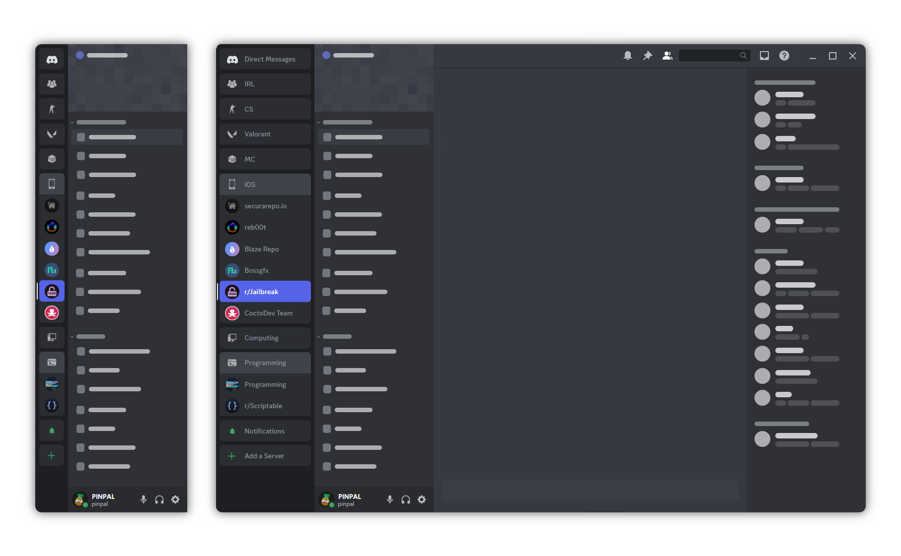
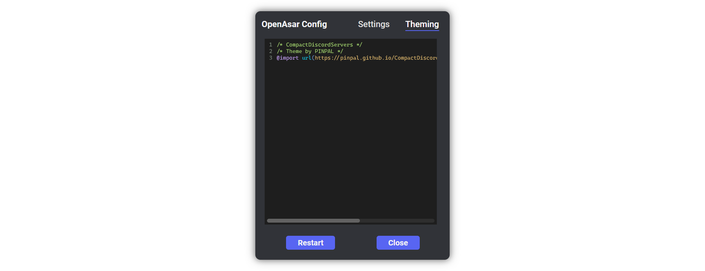

# StyledGuildsAsChannels

Stylesheet to Display Servers in a list view.\
Menu expands when hovering over the regular sidebar.


# Requirements

[OpenASAR](https://openasar.dev/) - Discord CSS Injector

Or any other CSS Injector such as [BetterDiscord](https://betterdiscord.app/)

# Installation

Add the following to your CSS Config:

```css
@import url(https://pinpal.github.io/CompactDiscordServers/assets/css/main.css);
```


