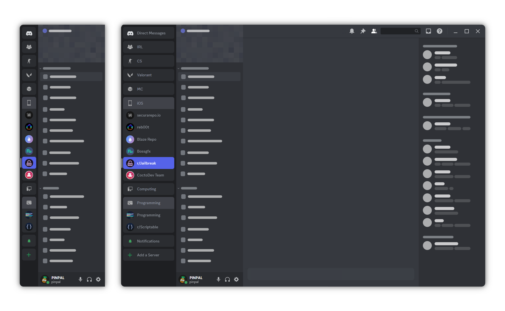
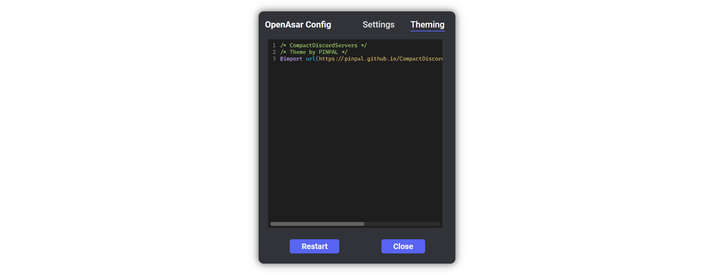

# StyledGuildsAsChannels

Stylesheet to Display Servers in a list view.\
Menu expands when hovering over the regular sidebar.


# Requirements

[OpenASAR](https://openasar.dev/) - Discord CSS Injector

Or any other CSS Injector such as [BetterDiscord](https://betterdiscord.app/)

# Installation

Add the following to your CSS Config:

```css
@import url(https://pinpal.github.io/CompactDiscordServers/assets/css/main.css);
```




# Customisation
<details>
  <summary>Click to View all the variables you can adjust in your CSS Config</summary>

**Sidebar Width**
```scss
:root {
    // Width of the sidebar when Expanded
	--gac-expanded-width: 220px;
    // Width of the sidebar when Collapsed
	--gac-collapse-width: 72px;
}
```

**Other Settings**
```scss
:root {
    // Height of each server in the sidebar
	--gac-server-height: 48px;

    // Size of padding (white space) 
    // Also used as a multiplier for larger/smaller padding sizes
	--gac-padding: 8px;

    // How rounded the corners of servers/folders are
	--gac-border-radius: 8px;
}
```

**Animations**
```scss
:root {
	// Timing function for sidebar collapse/expand animation
	--gac-transition-timing-func: ease-in-out;
	// Duration that animation for sidebar collapse/expand takes
	--gac-transition-duration: 0.2s;
	// Delay before sidebar collapses after you stop hovering
	--gac-transition-delay: 0.65s;
}
```

**Colors**

By default, they inherit from your Discord Theme.
```scss
:root {
    // Background of servers/folders
	--gac-box-color: var(--background-secondary);
    // Background of servers/folders (when hovering)
    --gac-hover-color: var(--background-modifier-selected);

    // Color of text (eg: server name)
	--gac-text-color: var(--channels-default);
    // Color of text when hovering
	--gac-text-hover-color: var(--interactive-active);

	// Background for the header of an expanded folder
	--gac-hover-color-overlay: var(--background-modifier-hover);

    // Background for selected server (the one you are currently in)
	--gac-accent-color: var(--bg-brand);
    // Background while hovering for selected server (the one you are currently in)
	--gac-accent-hover: var(--brand-430);
}
```
</details>